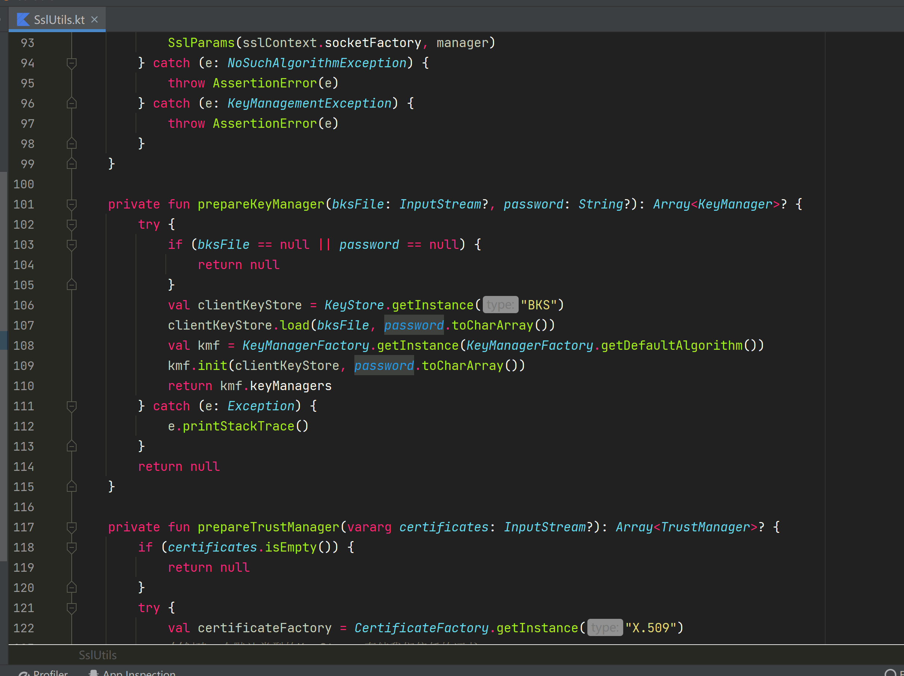
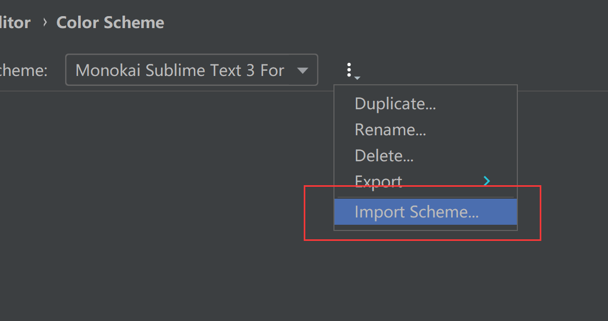

# Monokai_Sublime_Text_3_For_AS
A beautiful color scheme for Android Studio

---
## Preview

## Install
Download `.jar` or `.icls`,then import it in Android Studio.

File - Setting - Editor - Color Scheme - Import Scheme

## Applicable AS Version

Android Studio Bumblebee | 2021.1.1

## Thanks
This is the Color Scheme I started using when I first started learning Android seven years ago, I don't know who it's author is, but I'm grateful for such a beautiful color scheme, and with the update to Android Studio, it's starting to have It didn't fit at all, so I adjusted some settings, and now it works perfectly on my device, if you find any problems when using it, you can post an issue and I'll try to adjust it.